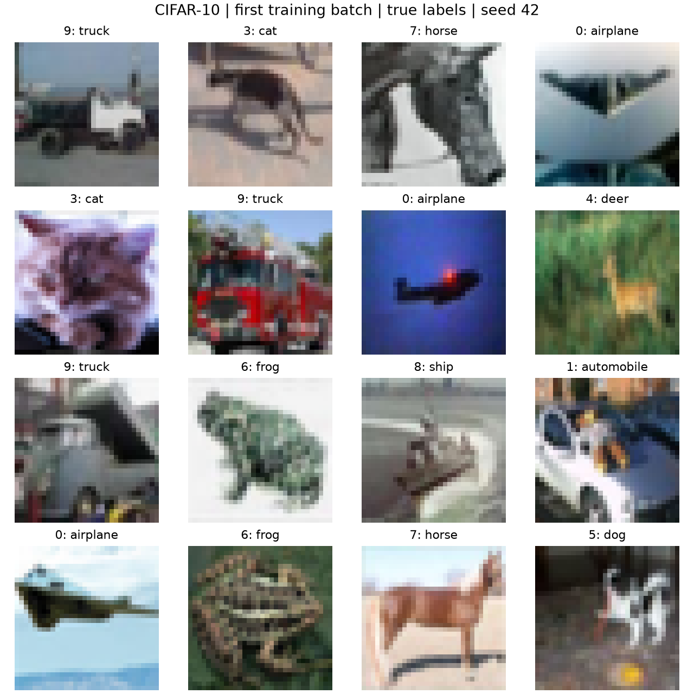

# 01 · Tiny ViT / CIFAR-10

状态：三项调整已落实，[执行方案](PLAN.md)已生效。**阶段 1 数据观察与阶段 2 Tiny ViT forward 均已完成**，当前学习入口是 [02-forward.md](notes/02-forward.md)，已补充 [CPU/GPU 计时](notes/02-device-benchmark.md)与[结构图核对](notes/02-diagram-review.md)。阶段 3–5 尚未实施，尚未更新模型参数。

## 1. 问题 / Question

一张图如何变成分类 logits？loss 如何产生梯度？谁更新参数？模型记住训练数据与学会泛化有什么区别？训练中断后需要恢复哪些状态？

本实验以理解这些过程为目标，不设置 CIFAR-10 准确率排名目标。

## 2. 假设 / Hypothesis

- `backward()` 产生参数梯度，`optimizer.step()` 才更新本模型的参数。
- 关闭增强、dropout 和权重衰减后，小模型应能记住固定的 32 张训练图；失败时检查实现及优化设置。
- 训练与验证表现可能分离，应通过实际曲线判断，而不能只看训练准确率。
- 恢复训练需要模型与优化器状态；更严格的连续性检查还涉及随机状态与数据顺序。

以上训练相关假设仍待后续验证。数据读取和 forward 的实测证据见下方结果。

## 3. 实现 / Implementation

参考资料与设计入口：

- [用户提供的原始大纲](notes/outline-original.md)：原文归档，保留教学思路和上下文。
- [大纲审阅与已采纳调整](notes/outline-review.md)：R1 梯度演示修正、R2 SSD 资产路径、R3 恢复训练记录。
- [执行方案](PLAN.md)：固定配置、文件职责、五阶段预算与验收方法。

沿用原稿的五阶段学习路线，每阶段都留下可阅读的观察结果和解释：

| 阶段 | 内容 | 要观察的证据 |
| --- | --- | --- |
| 1 | Dataset / DataLoader | 单样本与 batch 的区别、图像和标签 shape、样本网格 |
| 2 | Tiny ViT forward | patch、token、CLS 和 logits 的 shape |
| 3 | 单批训练一步 | backward 前后梯度，以及 step 前后参数变化 |
| 4 | 记住 32 张图 | 固定样本上的 loss 与 accuracy 曲线 |
| 5 | 完整 train / validation / checkpoint | 训练与验证曲线、模型选择、停止后恢复的检查 |

阶段 1 已实现 [data.py](src/data.py) 和 [inspect_data.py](src/inspect_data.py)。阶段 2 已实现 [model.py](src/model.py) 和 [inspect_forward.py](src/inspect_forward.py)，模型使用基础 PyTorch 模块显式组合，并提供 [7 项模型检查](tests/test_model.py)。阶段 3–5 尚未实现。

## 4. 实验设置 / Experiment Setup

原稿提出的核心设置：

| 项目 | 设置 |
| --- | --- |
| 数据 | CIFAR-10，RGB，32×32，10 类 |
| 划分 | 官方 50,000 训练图进一步划为 45,000 train / 5,000 validation；官方 10,000 test 留到最终评估 |
| 模型 | 随机初始化 Tiny ViT；patch=4，embed_dim=128，depth=4，heads=4，mlp_ratio=4 |
| 损失 | CrossEntropyLoss，输入未经 softmax 的 logits |
| 优化器 | AdamW，学习率 3e-4；完整训练候选 weight_decay=1e-2，32 图记忆实验设为 0 |
| 第一版 | 显式 PyTorch 训练循环，单设备，float32 |
| 环境 | Python 3.12.3；torch 2.14.0+cu130；torchvision 0.29.0+cu130；matplotlib 3.11.2；tqdm 4.70.1 |
| 完整依赖 | [requirements-lock.txt](requirements-lock.txt)，安装后 `pip check` 通过 |
| 阶段 1 配置 | [01-data.json](configs/01-data.json)：seed=42，batch=128，worker=0，CPU 线程=4，ToTensor，无增强 |
| 阶段 2 配置 | [02-forward.json](configs/02-forward.json)：seed=42，B=2/128，CPU 线程=4；像素从 [0,1] 映射到 [-1,1] |
| 模型实际参数量 | 809,354；patch 投影、QKV/Linear、CLS 和位置编码采用截断正态初始化；bias=0，LayerNorm weight=1；详见配置、代码与结果摘要 |
| 数据划分 | 按类别分层，每类 train=4,500、validation=500；固定索引保存在 SSD，运行时记录 SHA-256 |
| 其余阶段配置 | 见 [PLAN.md](PLAN.md)，其中预算为计划值 |
| 代码版本 | 阶段 1–2 的结果在首次提交前生成，原运行保留代码快照与哈希；发布后新增运行记录 Git commit 和工作区变更 |

资产位置遵循[仓库约定](../README.md)：代码与小型记录进入实验目录，环境、数据及完整运行产物使用仓库外的 `LAB_ROOT`。原稿的相对路径示例已在执行入口按 R2 适配。

用户已为本实验指定 GPU，后续模型阶段持续沿用。实际设备保存在本机 `.local/device.json`，每次启动按 UUID 选择并复查占用，不重新询问或自动换卡。首次阶段 1–2 使用 CPU；现已完成 GPU forward 验证和六种 batch 的计时。环境首次 GPU 运行遇到 cuDNN 子库混用，已通过配套依赖升级解决，见[环境修复记录](notes/02-gpu-environment.md)。

CIFAR-10 的官方数据规模与图像尺寸已核对。[官方数据集说明](https://www.cs.toronto.edu/~kriz/cifar.html)

### 复现阶段 1

以下命令从**仓库根目录**运行。在本机加载已有环境脚本；其他机器需先按仓库约定配置外部资产目录与缓存变量。

```bash
source ./硬件环境配置信息/experiment-env.sh
cd 01-ViT-CIFAR-10

# 本机已完成安装；新环境第一次准备时执行。
bash scripts/setup_env.sh

# 数据已准备好时使用本地文件，每次创建新的运行目录。
bash scripts/inspect_data.sh

# 仅首次数据准备时需要 --download；由 torchvision 校验并解压官方归档。
# bash scripts/inspect_data.sh --download
```

也可逐步查看核心操作：

```python
image, label = dataset[i]                 # 一张图 [3,32,32] + 一个整数标签
images, labels = next(iter(train_loader)) # 一批图 [128,3,32,32] + 标签 [128]
```

上面两个 Python 片段用于解释已有 Dataset/DataLoader 对象，完整可运行入口为 shell 脚本。`inspect_data.sh` 会使用本实验独立解释器并隐藏 GPU，不依赖当前 shell 激活了哪个 Python 环境。

PyTorch 与 torchvision 采用配套的已发布版本；当前环境已经通过 GPU forward 检查。早期 CPU 观察所用旧版本仍记录在原结果中。[官方安装配对](https://pytorch.org/get-started/previous-versions/)

### 复现阶段 2

从仓库根目录开始，沿用已安装环境与本地数据：

```bash
source ./硬件环境配置信息/experiment-env.sh
cd 01-ViT-CIFAR-10
bash scripts/inspect_forward.sh
```

入口先运行 CPU 模型检查，然后在已指定 GPU 上输出实际 shape、patch 图与初始 logits。它只做 forward；使用 `bash scripts/inspect_forward.sh --cpu` 可在当前环境复现 CPU 观察。

运行不同 batch 的 CPU/GPU 对比：

```bash
bash scripts/benchmark_devices.sh
```

基准固定模型、输入、FP32 精度与 CPU 4 线程，分别测 CPU、GPU、GPU 含传输。每次输出独立运行记录，条件与解释见 [计时笔记](notes/02-device-benchmark.md)。

## 5. 结果 / Results

### 阶段 1：数据观察

运行：`01-data-538ab412b224`。这是数据观察结果，没有训练指标或模型检查点。

| 观察项 | 实测结果 |
| --- | --- |
| 训练 / 验证样本 | 45,000 / 5,000，每类分别 4,500 / 500 |
| 单张图片 | `[3,32,32]`，float32 |
| 一个 batch | 图像 `[128,3,32,32]`，标签 `[128]`，标签为 int64 |
| batch 像素范围 | [0,1] |
| 一次完整训练集遍历 | 352 批，最后一批 72 张；本次仅观察首批，没有遍历训练 epoch |
| 正确性检查 | 划分互斥且完整、类别平衡、图片标签对应、shape/类型/范围、同种子首批一致：全部通过 |
| GPU / test | 未初始化 CUDA，未评估官方测试集 |

查看[完整观察摘要](results/01-data/summary.json)、[样本网格](results/01-data/batch-preview.png)与[阶段 1 学习笔记](notes/01-data.md)。图上的名称是真实标签，当前尚无模型预测。



### 阶段 2：Tiny ViT forward

运行：`02-forward-e4cef5b6ad62`。实测数据流：

```text
[2,3,32,32] → [2,128,8,8] → [2,64,128]
 → 拼接 CLS [2,65,128]
 → 加位置编码、四个 Transformer block [2,65,128]
 → 最终 LayerNorm、取 CLS [2,128]
 → Linear [2,10] logits
```

- 参数数：809,354；B=2 与 B=128 均通过检查。
- 单张图单独计算与在 batch 中计算的结果一致到检查容差；两个 batch 中相同前两张图片的输出在本次运行中最大绝对差为 0。
- forward 前后模型状态一致，全部参数 grad 为 None；没有训练准确率或 loss 结果。
- 7 项检查覆盖 patch 线性投影等价性、batch 独立性、图像影响 CLS 输出、block 参数独立性、forward 不修改状态、固定种子初始化和错误输入。

查看[阶段 2 学习笔记](notes/02-forward.md)、[完整摘要](results/02-forward/summary.json)、[patch 示意图](results/02-forward/patch-to-token.png)和[真实 logits](results/02-forward/first-image-logits.csv)。

### 阶段 2 补充：GPU 与 batch 规模

GPU forward：`02-forward-a82a1eb6235d`，见[结果](results/02-forward-gpu/README.md)。CPU/GPU 对比：`02-device-benchmark-8d295c88b727`，B=1/2/8/32/128/512 全部通过数值一致性检查，最大绝对差约 4.92e-7。

B=1 的 CPU/GPU 纯 forward 分别约 2.613/1.354 ms；B=128 约 130.107/1.455 ms；B=512 约 617.145/5.213 ms。CPU 使用 4 线程，未测反向传播；详见[完整表格与曲线](results/02-device-benchmark/README.md)。

## 6. 分析 / Analysis

数据读取、划分和模型 forward 已验证。token shape 在 Transformer block 中保持不变，但其数值会变化；初始 logits 仅为随机初始化模型的分数。梯度、参数更新、泛化与恢复训练需要后续阶段的证据。

## 7. 学到的内容 / What I Learned

用户已正确回答阶段 1 的三个问题：batch 形状、标签一一对应和 batch size 不改变单图形状。阶段 2 的回答整体正确；位置编码通过 batch 维广播共享，labels 保存真实类别编号。用户结构图与模型一致，需修正一处 MLP 算术笔误并在流程中补最终 LayerNorm，见[核对记录](notes/02-diagram-review.md)。

## 8. 下一步 / Next Experiment

阶段 2 问题已回答，GPU 性能观察与图解核对已补充。下一阶段沿用已指定 GPU，对一个 batch 执行一次训练 step，观察 loss、梯度以及 optimizer.step 前后的参数变化。
