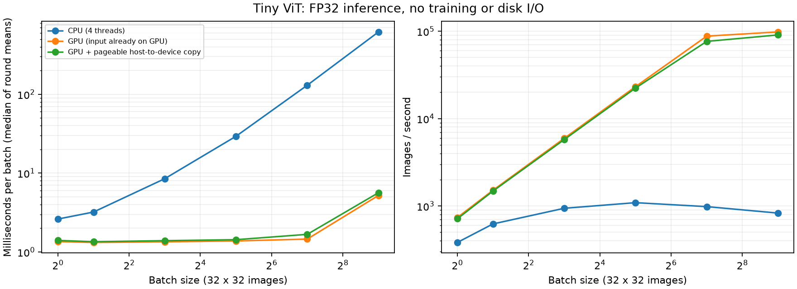

# 阶段 2 补充：batch 大小如何影响 CPU/GPU 速度

用户希望熟悉 GPU 在不同计算规模下的表现。本次固定 Tiny ViT 与 32×32 图像，只改变 batch 中的图片数。

## 实测结果

运行：`02-device-benchmark-8d295c88b727`。模型参数量 809,354，随机初始化；没有反向传播或参数更新。

| Batch | CPU 4 线程 ms | GPU ms | GPU 含传输 ms | 纯计算加速比 | GPU 图片/秒 | GPU 峰值 MiB |
| ---: | ---: | ---: | ---: | ---: | ---: | ---: |
| 1 | 2.613 | 1.354 | 1.400 | 1.9× | 739 | 11.7 |
| 2 | 3.208 | 1.320 | 1.349 | 2.4× | 1,515 | 12.1 |
| 8 | 8.495 | 1.344 | 1.390 | 6.3× | 5,951 | 14.9 |
| 32 | 29.317 | 1.379 | 1.431 | 21.3× | 23,211 | 26.5 |
| 128 | 130.107 | 1.455 | 1.672 | 89.4× | 87,943 | 69.5 |
| 512 | 617.145 | 5.213 | 5.642 | 118.4× | 98,223 | 246.5 |



## 怎样读这张表

- **ms/batch**：处理整批图片的时间，越小越快。这里每轮连续运行 10 次，计时结果除以 10；表中是 5 轮结果的中位数，不是单个在线请求的延迟分布。
- **图片/秒**：batch size 除以单批秒数，越大越快。batch=512 的单批耗时高于 128，但吞吐仍略高；“更大 batch”不等于“每批更快”。
- **加速比**：CPU 耗时 / GPU 耗时。CPU 使用 4 线程，没有搜索此服务器的最佳线程数；这些数字不是整台 CPU 与 GPU 理论峰值的比值。
- **显存**：PyTorch 记录的峰值已分配显存，包含模型、驻留输入和计算中间张量，不包括驱动上下文等全部显存。训练还要保存反传所需张量、梯度与优化器状态，不能据此直接推算训练 batch 上限。

B=1 到 32 的 GPU 耗时接近，但一次处理的图片增多，吞吐随之上升。这与小任务受启动和调度开销影响较大的解释相符；本次未用 profiler 分解每个 kernel 的时间。B=128 到 512 吞吐增长趋缓，不能由这六个点断言已达到硬件极限。

这些批次都来自相同的训练划分，较小 batch 使用同一批数据的前缀。样本数量增多不会增加模型参数量。本次没有改变图片分辨率、token 数或模型深度，因此结论仅覆盖 batch 这一种计算规模变化。

## 测量条件

- CPU 与 GPU 使用同一环境（torch 2.14.0+cu130），同一模型权重和输入数据；seed=42。
- CPU 4 个计算线程、1 个 inter-op 线程；一张用户指定 GPU，设备身份仅记本地。
- FP32 IEEE；关闭 TF32，未启用 AMP、compile；cuDNN 保持开启，benchmark=False。
- `model.eval()` + `torch.inference_mode()`；各 batch 的每种模式先预热 10 次，再测 5 轮，每轮 10 次；每轮轮换三种模式的执行顺序。
- 使用 `time.perf_counter()`；每个计时段前后同步 CUDA，避免只测到异步提交任务的时间。机器日期不影响单调时钟耗时。[PyTorch 计时教程](https://docs.pytorch.org/tutorials/recipes/recipes/benchmark)
- GPU 纯计算：输入已在显存；GPU 含传输：每次从普通 CPU 内存用阻塞 `.to()` 复制后 forward，未使用锁页内存或传输重叠。
- 三种模式都不包含磁盘读取、DataLoader、标准化与首次初始化。本次没有测 SSD 性能；CPU 测量时保留 GPU 模型和输入驻留，但不同时执行 GPU forward。
- 共享服务器上的调度、频率与其他任务会带来波动。JSON 保存每轮平均耗时，CSV 保存四分位数；只有一次完整基准，不将它视为跨时段稳定性测试。

## 正确性与复现

六种 batch 均检查 CPU/GPU logits 接近，容差 atol=1e-5、rtol=1e-4，最大绝对差 `4.917e-07`。两边模型权重一致，测量前后参数保持不变，grad 全部为 None。原始数据和划分 SHA-256 与阶段 1 一致，未使用官方测试集。

```bash
# 从仓库根目录开始
source ./硬件环境配置信息/experiment-env.sh
cd 01-ViT-CIFAR-10
bash scripts/benchmark_devices.sh
```

默认使用本机 `.local/device.json` 中已指定的卡。启动前复查该卡占用；若被占用，先检查当前任务，不自动换卡。完整运行产物在 SSD 的 `$LAB_RUNS_DIR/01-ViT-CIFAR-10/<run_id>/`；公开摘要见 [results](../results/02-device-benchmark/README.md)。

下一阶段的单步训练与后续训练沿用这张卡。到时可进一步测 **forward + loss + backward + optimizer.step**，再观察数据加载对端到端吞吐的影响。
