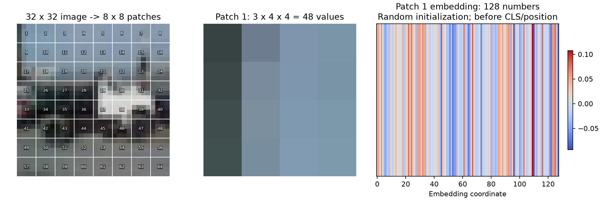

# 阶段 2：图片如何变成十个分类分数

状态：已完成 Tiny ViT 实现，首次在 CPU 上对真实训练图片执行 B=2 和 B=128 的 forward；下文原始数值来自该次运行。现已在用户指定 GPU 上复查，并补充[不同 batch 的性能对比](02-device-benchmark.md)。7 项模型检查全部通过，参数没有更新，所有参数的 `.grad` 都为 None。

主运行：`02-forward-e4cef5b6ad62`。查看[结果摘要](../results/02-forward/summary.json)、[patch 示意图](../results/02-forward/patch-to-token.png)与[首张图片的 logits](../results/02-forward/first-image-logits.csv)。

## 1. 从你已经理解的 batch 接着走

上一阶段你已正确区分单张图 `[3,32,32]`、一批图片 `[128,3,32,32]` 和标签 `[128]`。这次先只取 2 张图，避免 batch size=128 和 embedding dimension=128 看起来混在一起。

本阶段输入先做 `(像素值 - 0.5) / 0.5`，将 [0,1] 映射到 [-1,1]；shape 不变。这里 0.5 是我们固定选择的参数，并不是从验证集或测试集统计出来的均值与标准差。[Normalize 官方说明](https://docs.pytorch.org/vision/0.28/generated/torchvision.transforms.Normalize.html)

## 2. 一张图为什么有 64 个 patch

图片高和宽都是 32，每个 patch 高和宽都是 4，互不重叠：

```text
每行 32 / 4 = 8 个 patch
每列 32 / 4 = 8 个 patch
一张图共有 8 × 8 = 64 个 patch
```

patch 仍保留三个颜色通道，因此每个 patch 包含 `3 × 4 × 4 = 48` 个像素数值。



左图按从左到右、从上到下编号 1–64；中图放大第一个 patch；右图展示它投影后的 128 个数值。右图是 embedding 数值的颜色表示，不是注意力图。展示原图用 [0,1] 像素，计算投影用标准化后的输入。

## 3. 48 个像素数值，为什么能变成 128 个数值

`128` 是我们选择的特征维度，不是图片尺寸，也不是类别数。模型用可学习的线性投影，把每个 patch 的 48 个输入数值组合成 128 个特征值：

```text
一个 patch: 48 个数
        ↓ 同一个可学习的线性投影
一个 image token: 128 个数
```

这次使用 `Conv2d(3,128,kernel_size=4,stride=4)` 完成切块与投影。卷积核与步长均为 4，所以恰好覆盖不重叠的 patch；所有 patch 共享这组投影参数。

已经用独立计算验证：先显式取出 patch，再用相同权重做 Linear，与这里的 Conv2d 投影数值一致。使用卷积实现投影不会使它变成一个多层 CNN 图像编码器。

卷积输出 `[2,128,8,8]`：这里第一个 2 是图片数量，第二个 128 是特征通道。随后把 8×8 个空间位置展开并交换维度，得到 `[2,64,128]`，即“2 张图，每张 64 个 token，每个 token 128 维”。

## 4. CLS 和位置编码各做什么

### CLS：增加一个 token

模型有一个可学习的 `cls_token` 参数，形状 `[1,1,128]`。forward 时将它扩展到 batch 中每张图的序列开头：

```text
64 个 image tokens + 1 个 CLS token = 65 个 tokens
[2,64,128] → [2,65,128]
```

CLS 不是 CIFAR 类别标签，也不是某个图像 patch。初始 CLS 向量在不同图片间共享；经过 self-attention，它能接收各自图片 token 的信息，最终作为分类头使用的图像表示。当前尚未训练，不能把它解释成已经学会的高质量图像摘要。

### 位置编码：逐元素相加

`position_embedding` 是形状 `[1,65,128]` 的可学习参数，包含 CLS 与 64 个 patch 对应的位置。它与 token **相加**，不增加 token 数，也不增加每个 token 的维数：

```text
[2,65,128] + [1,65,128] → [2,65,128]
```

这样不同空间位置拥有不同的位置表示。不要把“拼接 CLS”和“加位置编码”混为同一种操作。

## 5. 四个 Transformer block 内发生什么

阅读 [model.py](../src/model.py) 中 `TransformerBlock.forward`：

```text
tokens
  → LayerNorm → self-attention → 与原 tokens 相加
  → LayerNorm → MLP            → 与前一步结果相加
```

每个 block 的输入和输出都是 `[B,65,128]`。shape 相同不代表内容没变：self-attention 在一张图的 tokens 之间交换信息，MLP 对每个 token 的特征做变换，residual 保留一条直接传递原特征的路径。

4 个注意力头将 128 维分成每头 32 维，头数不会把 token 数从 65 变成其他值。MLP 中间维度为 `128×4=512`，然后投影回 128，以便相加。

我们显式设置 `batch_first=True`，所以 `[B,N,D]` 的第一维始终是图片数量。已验证一张图单独算与放进 batch 一起算的结果接近，避免不同图片之间错误地进行注意力计算。

四个 block 有独立的参数和初始数值；相同结构不表示共享同一份权重。本实验采用 ViT 的 patch token 思路，但使用小模型和自定初始化，不声称复现论文成绩。[ViT 原论文](https://arxiv.org/abs/2010.11929)

## 6. 从 65 个 tokens 到十个 logits

四层 block 后先做最终 LayerNorm，再取序列第 0 个 token：

```python
image_representation = tokens[:, 0]  # [B,128]
logits = self.head(image_representation)  # Linear(128,10) → [B,10]
```

第 0 个 token 就是之前放在开头的 CLS。其他 64 个 token 的信息已经可以通过 attention 影响 CLS；这里没有把全部 token 直接展平成分类输入。

### 本次真实 shape

| 步骤 | B=2 实测输出 |
| --- | --- |
| 输入图片 | `[2,3,32,32]` |
| patch embedding | `[2,128,8,8]` |
| 展开为空间序列 | `[2,64,128]` |
| 拼接 CLS | `[2,65,128]` |
| 加位置编码 | `[2,65,128]` |
| block 1、2、3、4，各层 | `[2,65,128]` |
| 最终 LayerNorm | `[2,65,128]` |
| 取 CLS | `[2,128]` |
| 分类头 logits | `[2,10]` |

B=128 也通过检查，只改变表中的 batch 维。两次计算中相同的前两张图的 logits 最大绝对差为 0；这描述本次环境与输入，不承诺所有设备上逐位一致。

## 7. logits 是分数，还不是概率

首张图的真实类别是 truck。本次随机初始化模型对部分类别输出：

| 类别 | logit，四舍五入 |
| --- | ---: |
| airplane | 0.03367 |
| horse | 0.23918 |
| truck | -0.04584 |

这些数可以为负，也不要求加起来等于 1。`0.23918` 不表示 23.918% 的概率。当前模型参数随机初始化，分数最高的类别也不代表模型已经学会识别图片。

标签 `[B]` 保存每张图的正确类别编号；logits `[B,10]` 保存模型对十个类别的分数。下一阶段会用 CrossEntropyLoss 把这两者联系起来。

## 8. 模型规模与本轮边界

实际参数总数 **809,354**：patch embedding 6,272；CLS 128；位置编码 8,320；每个 block 198,272，共四个；最终 LayerNorm 256；分类头 1,290。

本轮使用 `model.eval()` 和 `torch.inference_mode()`，只观察 forward。模型本身的 `forward` 没有禁用梯度的装饰器，之后仍能用于训练；本轮没有 loss、backward 或 optimizer，也没有更新参数。7 项检查已通过，完整记录保存在 SSD。

## 9. 运行与阅读

从仓库根目录开始：

```bash
source ./硬件环境配置信息/experiment-env.sh
cd 01-ViT-CIFAR-10
bash scripts/inspect_forward.sh
```

脚本先运行模型检查，再默认用已指定 GPU 打印 B=2、B=128 的实际 shape，并生成新的独立运行目录；加 `--cpu` 可使用 CPU。核心模型看 `model.py`；`inspect_forward.py` 中的元数据记录和绘图部分可以稍后再读。

## 10. 留给你的三个问题

1. 为什么 32×32 的图片按 4×4 切块，会得到 64 个 image tokens？如果 patch 改为 8×8，加上 CLS 后一共有多少个 tokens？
2. `[2,65,128]` 三个数各表示什么？为什么加位置编码后 shape 不变？
3. `logits` 是 `[2,10]`，`labels` 是 `[2]`，它们分别保存什么？logit=0.23918 能直接理解为 23.918% 的概率吗？

下一阶段是只对一个 batch 做一次训练 step，观察 loss、梯度和参数变化。

## 11. 回答与结构图核对

三个问题已回答，整体理解正确。位置编码的 batch 广播、labels 的类别编号例子，以及结构图中 MLP 笔误与最终 LayerNorm 的补充，见 [02-diagram-review.md](02-diagram-review.md)。
