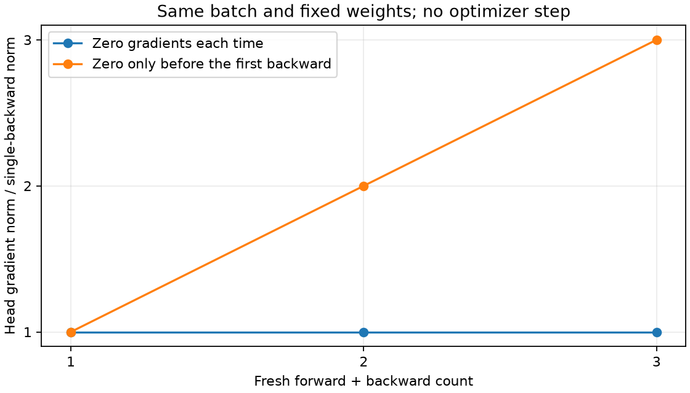

# 阶段 3：loss、梯度与第一次参数更新

状态：已在本实验指定 GPU 上完成。固定 128 张训练图片，**主模型只执行一次 `optimizer.step()`**；另用初始权重副本完成梯度清零对照。阶段 4 的 32 图记忆实验尚未开始。

运行：`03-step-ea5732fd1e68`。[结果摘要](../results/03-step/summary.json)、[所有参数的观测表](../results/03-step/parameters.csv)、[梯度累积对照](../results/03-step/accumulation.csv)。

## 1. 先看五行训练主干

```python
optimizer.zero_grad(set_to_none=True)  # 清理上次留下的梯度
logits = model(images)                # [128,3,32,32] -> [128,10]
loss = criterion(logits, labels)      # [128,10] 与 [128] -> 标量
loss.backward()                      # 计算参数的 .grad
optimizer.step()                     # 使用梯度更新参数
```

完整观察代码在 [inspect_step.py](../src/inspect_step.py) 的 `inspect_one_step()` 中。优先读这五步之间的注释；`run_record.py` 负责保存运行依据，可以稍后阅读。

这次使用 `model.train()`，并开启梯度记录。`train()` 设置模块的训练行为；它本身不会执行反向传播或更新权重。阶段 2 使用的 `inference_mode()` 不适合包住训练 forward，因为训练需要保留反向传播所需的计算记录。

## 2. labels 如何与 logits 联系起来

你已经知道：

```text
logits[0]：模型给第一张图的 10 个类别分数
labels[0] = 9：第一张图的真实类别编号，truck
```

`CrossEntropyLoss` 会比较真实类别与模型分数。对单张图，它等价于：

```text
先将 logits 转为各类别概率
取出真实类别对应的概率 p
单张图片的 loss = -ln(p)
```

实际调用**直接传 logits，不预先调用 softmax**；框架内部用数值稳定的计算完成这件事。[CrossEntropyLoss 官方说明](https://docs.pytorch.org/docs/2.14/generated/torch.nn.CrossEntropyLoss.html)

第一张图的实测值：

| 观察项 | 数值 |
| --- | ---: |
| 真实类别 | 9，truck |
| 模型给真实类别的概率 | 0.093593，约 9.36% |
| 该图片的 loss：`-ln(p)` | 2.368798 |
| 整批 128 张图的平均 loss | **2.294613** |

第一张图的 loss 与整批平均 loss 不同。我们用默认的 `reduction='mean'`，所以 128 个单图损失最后平均成一个数，shape 为 `[]`。

均匀分配十类概率时，loss 是 `-ln(0.1) ≈ 2.302585`，可作为理解初始量级的参照；随机模型不会恰好给每一类 0.1。

## 3. backward 到底改了什么

实测分类头参数 `head.weight[5,98]`，它是整个分类头矩阵中的一个数：

| 时刻 | 参数值 | 该参数的梯度 |
| --- | ---: | --- |
| 清理梯度后、forward 前 | 0.0180839114 | `None` |
| forward 和 loss 后 | 0.0180839114 | `None` |
| `loss.backward()` 后 | 0.0180839114 | 0.2542979717 |
| `optimizer.step()` 后 | **0.0177839119** | 仍保留刚才的梯度 |
| 再次 `zero_grad(set_to_none=True)` 后 | 0.0177839119 | `None` |

**backward 计算了梯度，参数值还没有改变；step 才改变参数。zero_grad 清理梯度，不会把已学到的参数恢复到初始值。**

`.grad` 与对应参数形状相同。例如 `head.weight` 和它的梯度都是 `[10,128]`。这里一个正梯度表示：在当前点、其他参数固定时，稍微增加这个参数会使 loss 增大；它描述的是局部变化趋势。

所有 56 个参数张量都得到了有限梯度，backward 前后全部参数逐位不变，step 后 56 个参数张量均有元素改变。**56 是张量块数；809,354 是这些张量包含的可训练标量总数。**

分类头的梯度 L2 范数为 **1.415956**。范数把许多梯度数值概括成一个大小，不表示所有元素的梯度都一样，也不包含完整的方向信息。

## 4. 更新一次后的变化

| 同一个训练 batch | 平均 loss |
| --- | ---: |
| 更新前 | 2.294613 |
| 更新一次后 | 2.119175 |

这次更新后，同一批图片的 loss 降低了。这只是一次训练 batch 上的观察，不能说明验证集或测试集表现，也不保证每一步的 loss 都下降。更新后的复查保持同一 train 模式、dropout=0，不再次 backward 或 step。

优化器为 AdamW：学习率 `3e-4`，betas=`(0.9,0.999)`，eps=`1e-8`。本阶段明确设 `weight_decay=0`，便于观察梯度驱动的更新；完整训练的权重衰减另行设置。

AdamW 会利用梯度的一阶、二阶矩状态调整更新，不能用简单的 `参数 -= 学习率 × 当前梯度` 精确解释这里的数值。[AdamW 官方说明](https://docs.pytorch.org/docs/2.14/generated/torch.optim.AdamW.html)

## 5. 为什么需要 zero_grad

使用另一份**尚未更新的初始模型**，固定同一批图片，关闭随机操作。两组都没有调用 optimizer.step；每一次都重新 forward、计算 loss，再 backward。

| 第几次 backward | A：每次先清零，分类头 grad norm | B：仅开始清零，分类头 grad norm |
| ---: | ---: | ---: |
| 1 | 1.415956（1 倍） | 1.415956（1 倍） |
| 2 | 1.415956（1 倍） | 2.831912（2 倍） |
| 3 | 1.415956（1 倍） | 4.247868（约 3 倍） |



PyTorch 的 backward 会把新算出的梯度**加到**已有 `.grad` 中，不自动覆盖。两组的输入和权重固定，所以每次新算出的梯度相同；B 组就得到 `g`、`2g`、`3g`。[PyTorch 梯度清零教程](https://docs.pytorch.org/tutorials/recipes/recipes/zeroing_out_gradients.html)

这里比较了全部参数梯度张量，而不只看范数；本次对期望倍数的最大绝对差为 0。第三次的范数比约为 3.00000025，是浮点归约舍入带来的微小差异。

固定输入与权重是得到整齐倍数的关键。若换 batch 或中间更新参数，新梯度通常会不同。不清零三次也不等于训练三步：本对照只是累加梯度，权重一直没变。

## 6. 这次验证了什么

- 主模型恰好更新一次，所有 AdamW 参数状态的 step 都是 1；副本没有参数更新。
- 所有参数梯度存在且有限，forward/backward 不改参数，step 改参数，zero_grad 不改参数。
- CrossEntropyLoss 与真实类别的负 log 概率均值一致。
- 实际 `dloss/dlogits` 与公式 `(softmax(logits) - one_hot(labels)) / 128` 接近，最大绝对差约 `4.66e-10`。这项公式检查用于核对实现，现阶段不要求你手推。
- A/B 两组全部参数梯度匹配期望倍数，结束后梯度清理为 None。
- 数据、划分校验和与阶段 1 相同，批次原始索引已保存；本次仅使用训练集。

运行使用当前锁定环境、seed=42、FP32 IEEE、确定性算法和一张已指定 GPU。完整代码快照、Git 状态、日志和参数观测张量保存在 SSD。`observations.pt` 是教学观测文件；阶段 5 才实现包含优化器和随机状态的恢复训练 checkpoint。

## 7. 自己再运行一次

```bash
# 从仓库根目录开始
source ./硬件环境配置信息/experiment-env.sh
cd 01-ViT-CIFAR-10
bash scripts/inspect_step.sh
```

每次从固定种子的初始模型开始，创建独立运行目录；不会在上一次的模型上继续训练。

## 8. 留给你的三个问题

1. `loss.backward()` 执行后，参数和 `.grad` 各发生了什么？哪一步真正改变参数？
2. `logits` 是 `[128,10]`、`labels` 是 `[128]`，为什么最后的 loss 是一个标量？传给 CrossEntropyLoss 前需要自己做 softmax 吗？
3. 固定输入和权重，连续三次重新 forward/backward，只在开始清零，梯度为何接近三倍？这和执行三次 optimizer.step 有什么区别？

理解这一阶段后，再进入“让模型记住固定 32 张图”。
