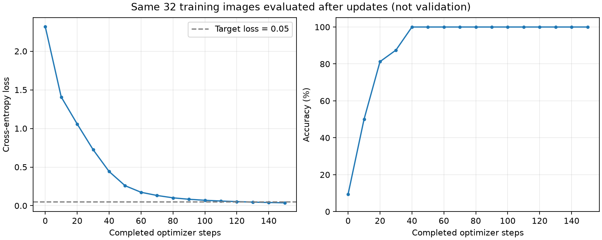
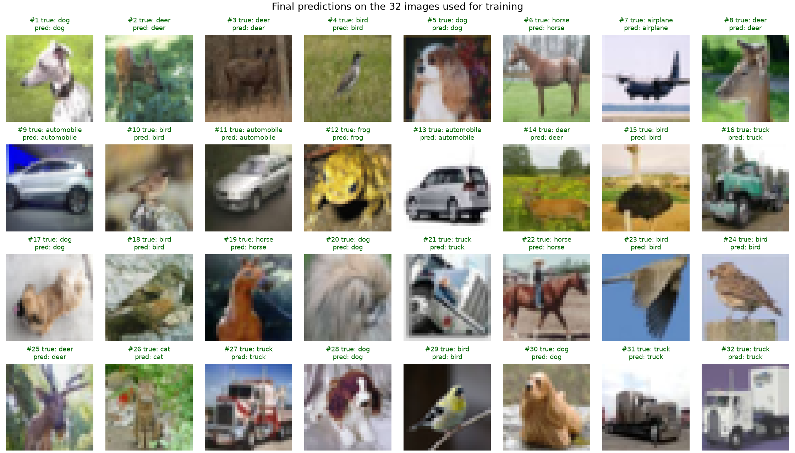

# 阶段 4：让 Tiny ViT 记住固定的 32 张图

状态：已完成。模型在本实验指定 GPU 上训练 **150 步**，达到约定的停止条件：固定 32 张训练图的 accuracy=100%、loss≤0.05，连续三个评估点满足。阶段 5 的完整训练与验证尚未开始。

运行：`04-overfit32-f206c27f589e`。[结果摘要](../results/04-overfit32/summary.json)、[评估曲线数据](../results/04-overfit32/evaluations.csv)、[逐图预测](../results/04-overfit32/predictions.csv)。

## 1. 从一步更新到反复学习

阶段 3 只更新一次参数；现在把同样的五步反复执行，每次仍然输入这 32 张图：

```python
for step in range(1, max_steps + 1):
    model.train()
    optimizer.zero_grad(set_to_none=True)
    logits = model(images)
    loss = criterion(logits, labels)
    loss.backward()
    optimizer.step()
```

关键点：**每一步都会清理旧梯度，并立即更新参数；下一步根据更新后的参数重新算梯度。** 这不是累积多次梯度后才更新一次。

学习入口是 [train.py](../src/train.py) 的 `train_fixed_batch()`；读五步主干后，再看每 10 步的评估与停止判断。

## 2. 这次固定了哪些条件

| 项目 | 设置 |
| --- | --- |
| 样本 | 原有 train 索引列表的前 32 项，32 张不同图片；索引和标签已保存 |
| 模型 | 原来的 809,354 参数 Tiny ViT，seed=42，重新随机初始化 |
| 输入 | 32×32，ToTensor 后 Normalize(mean=0.5, std=0.5)，无数据增强 |
| batch size | 32，每步使用全部 32 张图 |
| 优化器 | AdamW，lr=3e-4，betas=(0.9,0.999)，eps=1e-8，weight_decay=0 |
| 精度与随机性 | FP32 IEEE，确定性算法，dropout=0 |
| 预算 | 最多 1000 步，每 10 步评估一次；初始 step=0 也评估 |
| 停止条件 | accuracy=100% 且 loss≤0.05，连续三个更新后的评估点满足 |

本次从头初始化，没有继续使用阶段 3 更新过的模型。32 张图片先读入内存并搬到 GPU，训练循环反复复用这些输入。所有数据、环境、完整运行记录和最终权重保存在 SSD。

这 32 张图覆盖 9 类，数量不平衡，其中没有 ship。它们来自预先固定的索引，没有根据训练结果挑选或替换；这是记忆能力检查，不是代表整个 CIFAR-10 的评测集。具体分布见 [subset.json](../results/04-overfit32/subset.json)。

## 3. 实测曲线



| 已完成的更新步数 | loss | 正确数量 | accuracy |
| ---: | ---: | ---: | ---: |
| 0 | 2.318534 | 3/32 | 9.375% |
| 10 | 1.407525 | 16/32 | 50% |
| 20 | 1.057749 | 26/32 | 81.25% |
| 30 | 0.724796 | 28/32 | 87.5% |
| 40 | 0.442440 | 32/32 | 100% |
| 100 | 0.070031 | 32/32 | 100% |
| 130 | 0.046445 | 32/32 | 100% |
| 140 | 0.041408 | 32/32 | 100% |
| 150 | **0.037204** | **32/32** | **100%** |

第 40 步是**评估记录中首次达到 100%** 的位置；没有逐步评估准确率，因此不能断言第 31–39 步从未达到过 100%。

第 130 步开始同时满足两个目标；第 140、150 步继续满足，于是提前停止，没有跑满 1000 步。

图中每个点都是对应更新步数结束后，对固定 32 张图重新计算的指标。SSD 的 `steps.csv` 另存每次参数更新前的 loss；不要把它与同一步更新后的评估 loss 混为一谈。

## 4. 为什么准确率满分了，loss 还会下降

Accuracy 只关心：**分数最高的类别是不是正确类别。**

CrossEntropyLoss 还关心：**模型给真实类别的概率有多大。** 假设真实类别始终排第一：

```text
真实类别概率 0.60 → 分类正确，单图 loss = -ln(0.60) ≈ 0.511
真实类别概率 0.95 → 分类仍正确，单图 loss = -ln(0.95) ≈ 0.051
```

两次对 accuracy 的贡献都相同，但后者的 loss 更低。这解释了第 40 步以后，准确率保持 100%，loss 仍能继续下降。单次运行中的整体下降不保证每张图、每个训练步都单调改善。

## 5. 每 10 步“评估”，是不是在使用验证集

这里评估的仍然是**用于训练的这 32 张图**，没有使用原来的 5,000 张 validation 图。

```python
model.eval()
with torch.inference_mode():
    logits = model(images)  # 仍是同一组训练图片
```

`eval()` 设置模块的评估行为，`inference_mode()` 关闭梯度记录；它们不会自动选择一个数据集。数据来自哪里，要看传入的 `images`。

这次 dropout=0，模型没有 BatchNorm，不涉及这两类模块的训练/评估差异；仍显式切换模式，为下一阶段保留正确的训练和评估结构。评估函数结束时会恢复原来的模式。

## 6. 这能证明模型已经学会识别图片吗

它证明当前模型和训练流程能够把这 32 张图拟合到很低的 loss，完成了小样本记忆检查。最终逐图预测如下：



模型可以通过记住这些样本得到满分。仅凭训练图上的结果，无法判断它对没见过的图片是否有效，也不能量化训练与验证的差距；这些需要下一阶段的独立验证集。

通常把这个检查叫作“overfit a tiny batch”。这里先验证拟合能力，没有取得“验证表现随着训练变差”的证据；不要把当前曲线当成完整的过拟合诊断。

## 7. step、epoch 与 GPU 观察

一次 step 表示一次参数更新。这次一个 batch 恰好包含整个 32 图小集合，因此 150 步相当于遍历这个小集合 150 次，共呈现 `150×32=4,800` 张次，独立图片仍只有 32 张。这不是把原来的 45,000 张训练图遍历了 150 次。

训练循环加定期评估约 **4.50 秒**，包括有限值检查、同步与 CSV 写入，不含框架导入、数据准备、绘图和最终权重重载。PyTorch 记录的训练期间峰值已分配显存约 **151.8 MiB**，包含诊断开销，不等于驱动报告的全部占用。它们是本次运行观测，不是独立吞吐基准或最大 batch 容量测试。

## 8. 正确性与文件

- 数据和划分 SHA-256 与阶段 1 一致；32 个索引互异且全部属于 train，与 validation 无交集。
- 每步检查 loss 与梯度有限，评估时检查参数有限；第一次 backward 不改参数，step 才更新参数。
- 所有 AdamW 参数状态的 step 均为 150。
- 评估没有创建梯度，模型状态保持不变，并恢复训练模式。
- 最终权重写入 SSD 后重新加载到同一 GPU；预测 logits 的最大绝对差为 0，指标一致。
- 本次 seed=42 运行一次，未进行跨种子或跨设备重复性测试，未计算验证集和测试集指标。

`outputs/final-weights.pt` 仅保存模型权重；配置、索引、代码快照、版本、Git 状态及日志保存在同一个独立运行目录。它不是含 optimizer/RNG 状态的恢复训练 checkpoint；完整恢复协议留到阶段 5。

从仓库根目录复现：

```bash
source ./硬件环境配置信息/experiment-env.sh
cd 01-ViT-CIFAR-10
bash scripts/overfit32.sh
```

## 9. 留给你的三个问题

1. 第 40 步 accuracy 已是 100%，为什么 loss 还能从约 0.442 降到 0.037？//因为accuracy为100%，只能说明当前正确的分类是概率最大的，但是gradient并没有到0，继续overfit，相当于继续根据gradient调整参数，就能继续降低
2. 这 32 张图全部预测正确，能否说明模型在没见过的 CIFAR-10 图片上也能达到 100%？为什么？//不行，只能说明模型学会了这32张图，但并没有验证模型的泛化能力
3. 本实验每步使用同一批 32 张图，训练 150 步后，模型见到了多少张不同图片，完成了多少次参数更新？//模型应该还是只见到了32张图，完成了150次参数更新

理解后再进入完整 train / validation / checkpoint 阶段。
