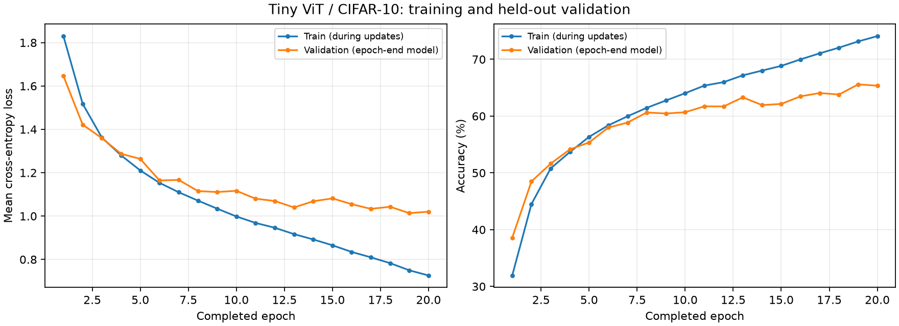

# 阶段 5：完整训练、验证与恢复

状态：**阶段 5 已完成**。固定 45,000/5,000 train/validation 划分上完成 20 epoch、7,040 次参数更新；最低验证 loss 出现在第 19 轮，验证准确率 **65.58%**。小子集和完整划分的恢复对照均完全一致。官方测试集尚未评估。

## 本次结果

| Epoch | Train loss | Train accuracy | Val loss | Val accuracy |
| --- | --- | --- | --- | --- |
| 1 | 1.829942 | 31.93% | 1.646145 | 38.58% |
| 6 | 1.153221 | 58.37% | 1.164338 | 57.98% |
| 13 | 0.916840 | 67.18% | 1.039611 | 63.30% |
| 19（best） | 0.749895 | 73.15% | 1.013452 | 65.58% |
| 20（last） | 0.726002 | 74.09% | 1.020374 | 65.36% |



第 19→20 轮，训练 loss 继续下降，但验证 loss 上升、验证准确率略降，因此 `best` 保留第 19 轮，`last` 保存第 20 轮。整体上验证表现明显改善，中间有波动；这次单种子、20 轮的结果显示训练拟合与验证表现并非同步，不能据此推断继续训练一定恶化，也不是充分的跨种子稳定性证据。

完整逐轮数据和恢复对照见 [结果记录](../results/05-train/README.md)。最终运行为 `05-train-f267ced4de42`；第 1–5 轮来自连续参考，第 6 轮来自恢复分支，第 7–20 轮从该分支继续。包括首轮试跑和重复第 6 轮，实际共执行 22 个完整数据 epoch，另有 7 个小子集 epoch。

## 1. 从 32 张图走向完整训练

你已经正确区分：accuracy 看真实类别是否排第一，交叉熵还关心真实类别概率；记住训练图不能证明泛化；150 次重复训练 32 张图仍然只见过 32 张不同图片。

这次使用原先固定的 **45,000 张 train、5,000 张 validation**。Tiny ViT 从 seed=42 重新随机初始化，不接着训练阶段 4 记住 32 张图的权重。官方 10,000 张 test 不参与训练、模型选择或本阶段评估。

| 设置 | 本阶段 |
| --- | --- |
| 模型 | Tiny ViT，patch=4，dim=128，depth=4，heads=4，809,354 参数 |
| batch / 精度 | 128 / FP32 IEEE |
| 优化器 | AdamW，lr=3e-4，weight_decay=0.01 |
| 数据处理 | ToTensor + Normalize 到 [-1,1]；无增强，dropout=0 |
| 数据顺序 | train 每轮 shuffle；validation 顺序固定 |
| DataLoader | num_workers=0、pin_memory=True、drop_last=False |
| 预算 | 主训练轨迹最多 20 epoch；另做一轮完整试跑和恢复对照 |
| 模型选择 | val_loss 最低的 epoch；相同 loss 保留较早模型 |

配置见 [05-train.json](../configs/05-train.json)，核心循环见 [train_full.py](../src/train_full.py)。

## 2. 一个 epoch 里发生什么

```text
45,000 张训练图
  → 打乱顺序
  → 351 个完整 batch + 最后 72 张 = 352 个 batch
  → 每批清零梯度、forward、loss、backward、step
  → 用当前模型评估 5,000 张验证图
  → 记录指标、保存 last，必要时更新 best
```

一个训练 epoch 有 **352 次参数更新**。验证分成 39 批 128 张和最后 8 张，共 40 批，但不执行 `backward()` 或 `optimizer.step()`。

```python
model.train()
optimizer.zero_grad(set_to_none=True)
logits = model(images)
loss = cross_entropy(logits, labels)
loss.backward()
optimizer.step()
```

训练从一个 batch 扩展为一整轮，主干仍然是你在阶段 3 学过的五步。

## 3. 训练指标和验证指标怎么统计

每个 batch 的 loss 是该批样本的平均值。最后一批较短，因此整轮平均值要按实际样本数加权：

```text
epoch_loss = Σ(batch_mean_loss × batch_size) / 总样本数
epoch_accuracy = 总预测正确数 / 总样本数
```

不能简单平均 352 个 batch 的 loss 或 accuracy，否则最后 72 张图片会获得偏大的权重。我们额外用长度为 3、batch=2 的例子检查这一点；小规模训练的尾批为 1 张，也实际走过这条路径。

**本记录的 train 指标来自训练过程中的各 batch，它们使用的参数一直在变化；val 指标来自整轮结束时的同一个模型。** 因此不能把两条曲线当作完全相同测量条件下的比较。若要严格比较同一模型在 train/val 上的表现，应另加训练结束模型对整个 train 的只读评估，并单独命名；当前没有额外计算这项指标。

## 4. 验证为什么不训练

[evaluate.py](../src/evaluate.py) 使用 `model.eval()` 和 `torch.inference_mode()`，读取验证图片、计算 logits、累计 loss 和正确数，然后恢复先前模式。它没有优化器参数，也不会调用参数更新。

- `eval()` 控制模块的训练/评估行为，不负责选择数据。
- `inference_mode()` 关闭梯度记录；验证不需要保存反向传播计算图。
- 训练入口检查验证前后权重一致、梯度为 None、优化器计数不变。

验证结果会影响我们选哪个 epoch 的模型，但不直接通过梯度修改权重。反复围绕同一验证集调配置也可能适应验证集，因此官方测试集继续保留。

## 5. best、last 和恢复训练

| 文件 | 含义 | 用途 |
| --- | --- | --- |
| `checkpoints/best.pt` | 验证 loss 最低时的完整状态 | 选择模型，重载检查验证结果 |
| `checkpoints/last.pt` | 当前运行最后一个完整 epoch 的状态 | 中断后继续训练 |
| `checkpoints/epoch-005.pt` 等 | 对应 epoch 的完整状态 | 指定恢复位置与连续训练对照 |

checkpoint 保存：model、optimizer、completed_epoch、global_step、best_val_loss、配置、数据索引和哈希、代码/环境标识，以及 Python、NumPy、PyTorch CPU/CUDA 和两个 DataLoader generator 的状态。`last` 还带有迄今最佳 checkpoint，使新运行能保留早期最佳模型。

只有权重能够用于推理，但不足以恢复相同训练轨迹：AdamW 有历史梯度统计，shuffle 有随机状态。实现先构造模型和 DataLoader，再加载权重/优化器，最后恢复随机状态；之后才开始下一轮。[PyTorch 保存和加载教程](https://docs.pytorch.org/tutorials/beginner/saving_loading_models.html)、[可复现性说明](https://docs.pytorch.org/docs/2.14/notes/randomness.html)。

文件先写临时文件再原子替换；使用 `weights_only=True` 读取，随机状态编码为张量和普通容器。所有 checkpoint 保存在仓库外的 SSD。

目前只支持 **epoch 边界恢复**。例如 completed_epoch=5 表示五轮已结束，下次从第 6 轮开始；如果在第 6 轮中途停止，从第五轮检查点恢复会重新训练第 6 轮。没有实现任意 batch 位置的精确续跑，也不承诺换 GPU 或软件版本后逐位一致。

## 6. 恢复对照怎样才算通过

```text
参考：同一初态 → epoch 1 → … → epoch 5 → epoch 6
恢复：读取 epoch 5 的 checkpoint → 在新进程中训练 epoch 6
```

比较两边第 6 轮结束后的参数、AdamW 状态、随机状态、指标、样本顺序哈希和最佳模型选择；耗时和显存观测不要求相同。小子集先完成此检查，再在完整 train/validation 划分上执行。

小子集（257 张 train、129 张 validation）和完整划分（45,000/5,000）的检查均已通过。完整划分的两条轨迹在第 6 轮结束、global_step=2,112 时，56 个模型参数张量、168 个优化器状态张量、随机状态、指标与样本顺序全部一致，参数最大绝对差为 **0**。

这里验证的是“从同一份第五轮状态继续，能否走出相同的第六轮”。它不意味着任何 GPU、任意依赖版本都能得到相同结果，也不要求文件 SHA-256 一样——不同运行的 checkpoint 内含不同 run_id 等元数据，比较的是里面的训练状态。

## 7. 复现入口

```bash
# 从仓库根目录开始
source ./硬件环境配置信息/experiment-env.sh
cd 01-ViT-CIFAR-10

# 已安装的目标解释器；环境、缓存、临时文件在仓库外。
PYTHON="$LAB_ENVS_DIR/01-ViT-CIFAR-10/py312-cu130/bin/python"

# 第一轮完整数据检查；每次命令都会新建独立运行目录。
bash scripts/train_full.sh --until 1

# 确认正确性和资源后，建立连续六轮参考。
bash scripts/train_full.sh --until 6

# 将 reference_run 替换为刚才输出的运行 ID。
reference_run='填写连续六轮运行的 ID'
bash scripts/train_full.sh \
  --resume "$LAB_RUNS_DIR/01-ViT-CIFAR-10/$reference_run/checkpoints/epoch-005.pt" --until 6

# 将 resumed_run 替换为恢复运行的 ID。
resumed_run='填写恢复运行的 ID'
"$PYTHON" src/compare_resume.py \
  --reference "$LAB_RUNS_DIR/01-ViT-CIFAR-10/$reference_run/checkpoints/epoch-006.pt" \
  --resumed "$LAB_RUNS_DIR/01-ViT-CIFAR-10/$resumed_run/checkpoints/last.pt" \
  --output "$LAB_RUNS_DIR/01-ViT-CIFAR-10/$resumed_run/metrics/resume-comparison.json"

# 对照通过后，沿恢复轨迹继续到总计 20 轮；不是额外再训练 20 轮。
bash scripts/train_full.sh \
  --resume "$LAB_RUNS_DIR/01-ViT-CIFAR-10/$resumed_run/checkpoints/last.pt" --until 20
```

小规模协议使用同一入口加 `--config configs/05-resume-smoke.json`。GPU 身份沿用本机既有实验指定，每次启动复查占用；恢复会检查代码、配置、数据、设备和软件身份，不在不一致时默默继续。

全部运行完成后，可将六个角色对应的运行 ID 写成 JSON，结构参见结果目录的 `run-index.json`，再运行 `"$PYTHON" scripts/collect_training_results.py --runs <该JSON路径>` 导出精选结果。导出器要求所有运行和恢复对照成功，并拒绝覆盖已存在的 `results/05-train/`。

## 8. 如何理解这次硬件观测

完整数据首轮训练循环约 14.76 秒，其中主进程等待 DataLoader 返回 batch 的累计时间约 6.35 秒，PyTorch 峰值已分配显存约 381 MiB。计时包含有限值检查、指标同步、数据处理和传输，不是 GPU 纯计算吞吐测试；显存数值也不含驱动开销。

当前 torchvision 的 CIFAR10 在创建 Dataset 时把图片数组读入内存，随后按索引取图、转张量、标准化并组成 batch。因此这段取数等待不能直接归因于 SSD 读盘慢。`num_workers=0` 使数据准备与训练主要顺序执行；以后可在其余条件固定时对照 0/2/4 个 worker，测吞吐和内存，再决定是否调整。当前保留 0，形成可比较的首版基线。

显存尚有余量也不意味着本次就应该增大 batch：改变 batch 会改变每轮更新次数和优化过程。硬件调优需要同时记录吞吐与训练结果，不能仅追求 GPU 利用率。

主轨迹 20 轮累计训练循环 292.29 秒、验证 14.58 秒，二者合计约 5.11 分钟；不含检查点写盘、框架导入和绘图。单轮训练中位数 14.58 秒，含数据处理和诊断开销的吞吐中位数约 3,086 张/秒；这些不等于纯 GPU 计算速度。具体口径和额外检查预算见 [资源摘要](../results/05-train/resources.json)。

## 9. 留给你的三个问题

1. 如果某轮 train loss 下降、val loss 却上升，能否只凭训练 loss 就认为模型变好了？还要观察什么？//不能仅凭训练loss就认为模型编号，还要观察验证集的loss和accuracy，以及它在前后epoch的变化
2. 本次最低 val loss 在第 19 轮，训练结束于第 20 轮。加载验证最优模型、或者从最新训练进度恢复，分别应使用 `best` 还是 `last`？为什么？//因为我们事先规定以最低val_loss选模型，而第19轮最低，所以要验证最优模型需要从第19轮开始；但是从最新的训练进度恢复，自然是用第20轮
3. 从第五轮末恢复后，为什么不能只加载模型权重再重新设置 seed=42？optimizer 和 DataLoader generator 各保留了什么信息？
//第三题的核心是：重启程序后，怎样让第 6 轮接着第 5 轮结束时的状态继续训练？

  我们分开看三个东西：模型参数、优化器的记忆、随机过程的进度。

  ## 1. 模型参数：模型当前学到了什么

  训练完第 5 轮，模型里的权重已经变化了。保存并加载权重，就能保留这些学习成果。

  但权重并没有包含训练过程中的所有状态。例如，它没有记录 AdamW 之前见过的梯度。

  ## 2. 优化器状态：AdamW 还记得过去的梯度

  你已经理解：

  loss.backward()   # 计算当前梯度
  optimizer.step() # 根据梯度更新参数

  这里还有一层细节：AdamW 更新参数时，既使用当前梯度，也使用过去梯度的统计。

  它主要保存：

  - 梯度的移动平均：可以理解为过去一段时间的梯度方向。
  - 平方梯度的移动平均：反映过去梯度大小的情况，用来调整各参数的更新幅度。
  - 更新次数：参与 AdamW 内部的计算。

  因此，即使两个模型的权重相同、当前 batch 相同，算出的梯度也相同，如果一个 AdamW 保留了历史状态，另
  一个是刚创建的，下一次参数更新仍可能不同。

  ### 这和 zero_grad() 有什么关系？

  这是容易混淆的地方：

   内容                              zero_grad() 会不会清除
  ━━━━━━━━━━━━━━━━━━━━━━━━━━━━━━━━  ━━━━━━━━━━━━━━━━━━━━━━━━
   参数的 .grad，即当前累积的梯度    会
  ────────────────────────────────  ────────────────────────
   AdamW 内部保存的历史统计          不会

  所以，“每步清零梯度”和“优化器记住历史”可以同时成立。

  恢复训练时，需要把 AdamW 的这份记忆也加载回来。

  ## 3. 随机状态：接下来应该怎样打乱数据

  ### seed 决定随机过程的起点

  在相同的随机数生成算法下，用同一个 seed 初始化生成器，可以重新产生同一条随机序列。

  假设只有 A、B、C、D 四张图片，某个生成器产生了下面的顺序。这只是示意：

  第 1 轮：C A D B
  第 2 轮：B D A C
  ……
  第 5 轮：A C B D
  第 6 轮：D B C A

  连续训练时，生成器的内部状态一直在往前推进。第五轮结束后，它已经准备好生成后面的随机数。

  ### 重新设置 seed，相当于回到起点

  如果重启程序后，重新创建一个用相同 seed 初始化的生成器，它会重新从：

  C A D B

  开始，而不是自然接上第六轮的：

  D B C A

  所以：

  - 保存 seed：知道随机过程最初从哪里开始。
  - 保存随机状态：知道训练中断时，随机过程已经进行到哪里。

  可以把 seed 理解为“选定一本书”，随机状态理解为“保留书签”。训练五轮后继续阅读，需要找到书签所在的位
  置。

  DataLoader generator 保存的，就是训练数据打乱所用生成器的当前状态。 本实验给 DataLoader 使用了独立
  的 generator，因此它的状态也需要单独恢复。

  ## 4. 放回我们的实验

  第五轮结束时，已经完成：

  5 个 epoch × 每轮 352 次更新 = 1,760 次参数更新

  要接着训练第六轮，我们恢复的是：

  模型参数          → 第五轮结束时的权重
  AdamW 状态        → 当时的历史梯度统计与更新次数
  训练进度          → 已完成 5 轮、1,760 次更新
  随机数状态        → 中断时各生成器的内部状态
  DataLoader 状态   → 后续数据打乱所需的生成器状态

  然后再开始第六轮。

  所以第三题可以这样回答：

  > 只加载权重，只恢复了模型当前的参数。要延续原来的训练过程，还需要恢复优化器的历史状态和随机过程的
  > 当前位置。重新设置 seed 会从随机过程的起点开始，不能代替恢复中断时的随机状态。


