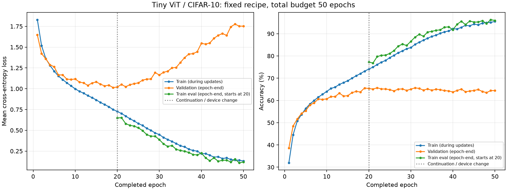

# 阶段 6 · 增加训练预算会发生什么？

状态：**已完成至总计 50 轮，恢复及监测检查通过**。训练集继续改善，验证 loss 明显上升；最低 val_loss 的 best 仍为第 19 轮。用户已回答三个学习问题，核对与第一题的细节补充见第 8 节；第七阶段尚未执行。

设计依据：[后续建议原文](followup-plan-original.md)；执行边界与迁移条件：[阶段 6 方案](06-budget-plan.md)。

## 1. 这次只延长训练预算

从第 20 轮的 **last** 继续至总计 50 轮，新增 30 轮。保持 Tiny ViT、45k/5k 划分、seed=42、batch=128、FP32、AdamW、lr=3e-4、weight_decay=0.01 不变，不加增强或 scheduler。

每轮 352 次参数更新，因此新增 10,560 次，总计 17,600 次。重新评估训练集只有 forward，不执行 backward 或 step，不计作额外训练 epoch。

按用户此前的设备指定，本阶段更换了物理 GPU。原训练代码与依赖一致，迁移后历史模型的验证 loss 和正确分类数量与原记录相同；这支持继续实验，但不能证明所有后续更新在不同 GPU 上都逐位相同。因此这是保持训练配方的续训观察，包含一次已记录的设备变化。

## 2. 为什么要增加 train_eval？

这一轮的 online train 指标大致来自：

```text
第 1 批：用参数 θ₀ 预测 → 更新到 θ₁
第 2 批：用参数 θ₁ 预测 → 更新到 θ₂
……
第 352 批：预测 → 更新到 θ₃₅₂
汇总各批预测的 loss 和正确数量
```

这一轮 train_eval 和 validation 则都使用固定的 **θ₃₅₂**：

```text
model.eval() + torch.inference_mode()
  ├─ 遍历 45,000 张 train → train_eval loss / accuracy
  └─ 遍历  5,000 张 val   → val loss / accuracy
不更新模型参数
```

即使本模型没有 dropout，两种 train 指标也可能不同，因为参数取自不同时间。`model.eval()` 只改变模块的运行模式，不意味着数据自动变成验证集；数据属于 train 还是 val 取决于使用的索引。

第 20 轮的实测例子：online train accuracy=74.09%，轮末 train_eval accuracy=77.24%，validation accuracy=65.36%。后两者使用同一组参数，可以更清楚地观察训练与验证之间的差距。

第 1–19 轮没有 train_eval，不补写猜测值。第 20 轮补测基线另存，后续每轮都有新指标。

## 3. 实现与恢复证据

- [train_budget.py](../src/train_budget.py) 调用原来的 `build_loaders`、`train_epoch` 和 `evaluate_loader`，阶段 5 源码与检查点原件保留。
- 从阶段 5 迁移只接受 epoch 20 完整 last；除阶段、预算和已指定设备外，其余模型、数据、依赖和原代码身份都要匹配。后续阶段 6 内再次恢复使用严格身份匹配。
- 加载后的 56 个模型参数张量、168 个 AdamW 状态张量、随机状态与保存值一致；优化器计数继续从 7,040 开始，不重新初始化动量。
- train_eval 有自己的顺序 DataLoader；观察前后保存并恢复 Python / NumPy / CPU / CUDA 与 DataLoader 随机状态，检查参数、优化器及模型模式未变化。
- [三项专项检查](../tests/test_budget.py) 覆盖迁移变更边界、阶段内恢复与 best 选择，以及“有无额外评估，下一次 AdamW 更新是否相同”。均已通过。
- 第 21 轮作为完整数据试跑，训练循环约 14.91 秒、train_eval 约 6.47 秒，PyTorch 峰值已分配显存约 381.35 MiB。试跑通过后由其 last 继续第 22–50 轮，不重复第 21 轮。

第 20 轮与原 best 第 19 轮在新设备上的验证 loss 绝对差均为 0，正确分类数量相同。这里验证的是这两个固定模型的指标；没有执行两张卡各自训练后续 30 轮的轨迹对照。

## 4. 复现命令

从仓库根目录开始。本机先加载本地环境脚本；在其他机器按仓库约定配置 `LAB_ROOT`、独立环境和自己的设备指定。

```bash
source ./硬件环境配置信息/experiment-env.sh
cd 01-ViT-CIFAR-10

# 先完成跨设备恢复和一轮资源检查；每次运行会创建新的 run ID。
bash scripts/train_budget.sh \
  --resume "$LAB_RUNS_DIR/01-ViT-CIFAR-10/05-train-f267ced4de42/checkpoints/last.pt" \
  --until 21

# 本次已通过的第 21 轮运行如下；复现时替换成自己刚生成的 run ID。
bash scripts/train_budget.sh \
  --resume "$LAB_RUNS_DIR/01-ViT-CIFAR-10/06-budget-56f9438e67a2/checkpoints/last.pt" \
  --until 50

# 本次结果导出；复现时替换两个 run ID，已有目标结果目录时会拒绝覆盖。
"$LAB_ENVS_DIR/01-ViT-CIFAR-10/py312-cu130/bin/python" scripts/collect_budget_results.py \
  --preflight "$LAB_RUNS_DIR/01-ViT-CIFAR-10/06-budget-56f9438e67a2" \
  --run "$LAB_RUNS_DIR/01-ViT-CIFAR-10/06-budget-4b59a2a02b22"
```

阶段内恢复会核对源码哈希、数据、完整配置、依赖和设备；复现旧运行可使用外部运行目录保存的源码快照。旧阶段 5 入口仍维持其同设备检查，不用于跨设备续训。

## 5. 阅读结果时抓住三件事

1. **训练与验证是否一起改善？** 如果训练改善而验证长期不改善，单纯增加轮数的泛化收益很有限；如果验证 loss 越来越高，则观察到了过拟合迹象。
2. **accuracy 与 loss 是否给出相同趋势？** accuracy 只看最高分对应的类别是否正确，交叉熵还关心真实类别的概率。错误预测变得更自信时，即使正确率变化不大，loss 也可能变差。
3. **best 与 last 各代表什么？** last 是第 50 轮完整训练状态；best 仍按 epoch 1–50 的最低 val_loss 选取，不因为总轮数增多就必然成为第 50 轮。

本次只有一个随机种子，不根据单次曲线推断模型架构的准确率上限。官方测试集留给第七阶段；本阶段不据测试表现调参。

## 6. 实测结果

最终运行：`06-budget-4b59a2a02b22`；第 21 轮试跑：`06-budget-56f9438e67a2`。新增 30 个完整训练 epoch，总轨迹 50 epoch、17,600 次更新。此前 20 轮的指标原样保留。

下面 train_eval 与 validation 使用同一轮结束的固定模型；第 19 轮 train_eval 没有测量。

| Epoch | Train eval loss | Train eval accuracy | Val loss | Val accuracy |
| --- | ---: | ---: | ---: | ---: |
| 19（best） | 未测 | 未测 | **1.013452** | **65.58%** |
| 20 | 0.648338 | 77.24% | 1.020374 | 65.36% |
| 30 | 0.387491 | 86.55% | 1.164331 | 65.06% |
| 40 | 0.225757 | 91.80% | 1.545476 | 63.80% |
| 50（last） | 0.119099 | 95.93% | 1.751647 | 64.42% |



### 如何读这次结果

**训练集拟合继续改善，验证准确率在平台附近波动，而验证 loss 明显恶化，呈现过拟合。** 第 20→50 轮，train_eval accuracy 上升约 18.69 个百分点，val accuracy 下降 0.94 个百分点；训练与验证的准确率差距由约 11.88 扩大到 31.51 个百分点。

这不是只比较两个偶然端点。连续 10 轮的平均验证 loss 为：

| 窗口 | 平均 val loss | 平均 val accuracy |
| --- | ---: | ---: |
| 21–30 | 1.094514 | 65.00% |
| 31–40 | 1.342833 | 64.77% |
| 41–50 | 1.666212 | 64.34% |

不要据此说“新增 30 轮什么也没学到”：训练集表现明显提高；但按预先确定的最低 val_loss 标准，没有选出更好的模型。也不能把这次结果当成 ViT 或 CIFAR-10 的准确率上限；它只对应当前训练配方和单一种子。

全程**最高 val accuracy 出现在第 22 轮，为 65.68%**，但它的 val_loss=1.023476，高于第 19 轮的 1.013452。因此我们保持原选择规则，best 仍为第 19 轮，不在看到结果后改用另一指标挑选模型。

train_eval 也不保证每轮都高于 online train：第 40 轮两者准确率分别为 91.80% 和 92.18%。参数更新会波动，轮末模型未必在所有训练图上都优于该轮过程中用过的参数；这不意味着评估在更新模型。

### 最终资产与资源

- `best.pt`：保留第 19 轮完整状态及原设备身份，重新加载后验证指标一致；供之后冻结模型进行最终评估。
- `last.pt`：第 50 轮完整状态，若另行授权延续当前进度，则下一轮为 51；不从第 19 轮回退重走。
- 第 21→22 轮新进程恢复时，模型、优化器与随机状态完全匹配。所有新增 train_eval 均检查不改变训练状态；最后写盘的模型、优化器与随机状态也与内存状态一致。
- 新增训练循环累计 **446.09 秒**，逐轮 train_eval **196.45 秒**，validation **21.86 秒**。另有第 20 轮 train_eval 基线约 6.46 秒、历史模型验证和最终 best 重载验证。
- 两次运行内部计时合计 **688.65 秒，约 11.48 分钟**，包含准备、额外评估和检查点写盘，不含进程导入及记录初始化之前的时间。PyTorch 峰值已分配显存约 **381.35 MiB**，不含驱动开销。
- 训练循环单轮中位数约 14.85 秒，含加载、传输和检查的吞吐约 3,029 张/秒；这不是 GPU 纯计算速度，也不是跨设备速度对照。
- 官方 test 始终未评估。阶段 6 未发生新的运行失败，原阶段 5 的结果、检查点与用户学习笔记保留。

精选文件见[结果目录](../results/06-budget/README.md)、[逐轮数据](../results/06-budget/epochs.csv)、[迁移检查](../results/06-budget/migration-checks.json)和[阶段内恢复检查](../results/06-budget/resume-checks.json)。完整资产保存在仓库外；本机索引为 `.local/latest-budget-run.json`。

## 7. 看完曲线后尝试回答

1. 为什么观察训练与验证的差距时，轮末 `train_eval` 比 online train 更适合与 validation 比较？
//因为"train_eval"是拿每个训练epoch之后的模型直接测试train_set的loss和accuracy，测试条件与validation_set完全一样；而online_train则是记录了每个batch的模型变化后得到的结果，是一个不断变化的模型参数，类似于352个模型的汇总（根据样本数得到的加权平均值），之所以要做这样一条加权平均曲线，是因为我们在训练时本来就是逐个batch调整参数的，已经有了所有batch的accuracy和loss，可以不用再跑整个epoch的forward，直接就能算一个值出来表示训练效果，加权汇总的是 loss 和 accuracy，不是模型参数。 这个数概括的是训练过程；轮末固定模型的表现由 train_eval 来衡量
2. 根据这次第 20→50 轮的曲线，继续增加训练轮数主要改善了什么？哪些证据支持你的判断？
//主要改善了模型对train_set的拟合程度，因为train_eval、online_train的accuracy和loss都改善了，但是generalization反而变差了，因为vlidation进入plateau，loss反而增大，出现了明显的过拟合
3. 如果下一阶段要做最终评估，你选 `best` 还是 `last`？如果之后要延续当前训练进度，又应该选哪个？//做最终评估选best，延续当前训练进度选last

下一阶段计划：冻结按 validation 选出的 best，首次评估官方 10,000 张 test，查看混淆矩阵并完成实验总结；当前尚未执行。

## 8. 回答核对

用户的原回答保留在第 7 节。三题的核心理解正确，第一题需要把统计时点和汇总方式说得更准确。

### 第一题：相同轮末模型，以及 online train 的统计时点

`train_eval` 与 validation 使用同一组轮末参数、相同的 eval / inference_mode 和指标计算方法；两者评估的样本集合不同，一个是训练集，一个是验证集。因此它们适合用来观察同一模型在已见和未参与训练样本上的表现差距。

online train 汇总的是**每个 batch 本次参数更新之前**计算的预测和 loss：

```text
第 1 批：用 θ₀ 得到 loss₁ 和预测 → step 得到 θ₁
第 2 批：用 θ₁ 得到 loss₂ 和预测 → step 得到 θ₂
……
第 352 批：用 θ₃₅₁ 得到 loss₃₅₂ 和预测 → step 得到 θ₃₅₂
train_eval 与 validation：都用固定的 θ₃₅₂
```

代码中的累加语句虽然位于 `optimizer.step()` 后，但使用的是此前已算好的 logits / loss，没有重新 forward。可以把 online train 理解为“同一个模型在 352 个训练时刻，对各自 batch 产生的结果汇总”；它不计算模型参数的平均值，也没有让每个参数版本都评估完整训练集。

汇总还按实际样本数加权：前 351 批每批 128 张，最后一批 72 张。epoch loss 为 `sum(batch_mean_loss × batch_size) / 45000`，accuracy 为 `total_correct / 45000`，不能直接对 352 个 batch 的均值再等权平均。

### 第二题：拟合改善，验证 loss 恶化

判断正确。训练 loss 下降、训练 accuracy 上升，说明模型进一步拟合训练集；validation accuracy 在平台附近波动、validation loss 持续上升，结合训练与验证差距扩大，支持本次出现明显过拟合。

更准确地说，进入平台的是验证 accuracy；验证 loss 正在恶化。单看 accuracy 平台不能断定过拟合，本次还有训练改善与验证 loss 上升的共同证据。结论适用于这次固定配方的运行，不表示任何进一步训练都必然使泛化变差。

### 第三题：best 与 last

判断正确：最终评估选按预定最低 val_loss 规则得到的 `best`（第 19 轮）；延续当前训练进度选 `last`（第 50 轮），恢复完整模型、优化器和随机状态后从第 51 轮开始。

本次只核对学习回答，没有启动第七阶段或新的训练。
