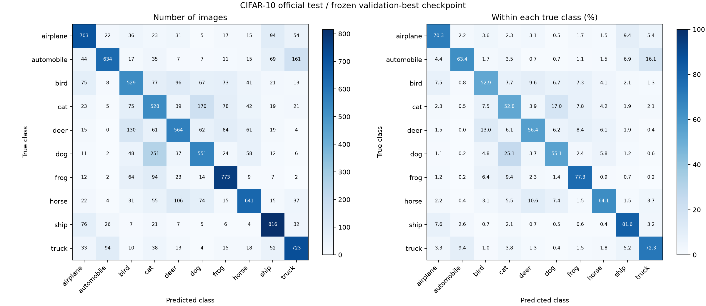
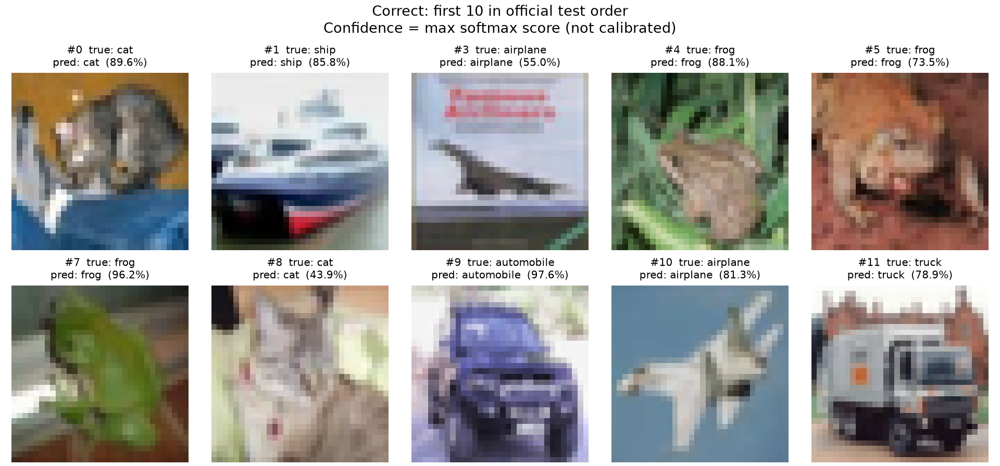
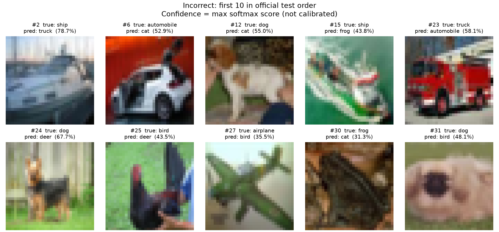

# 阶段 7 · 官方测试集最终评估

运行：`07-final-643922676edf`。

模型：按 epoch 1–50 的最低 val_loss 选择第 **19** 轮，读取 test 前固定。

| 数据 | 样本数 | Loss | Accuracy | 正确数量 |
| --- | ---: | ---: | ---: | ---: |
| Validation（重测） | 5,000 | 1.013452 | 65.58% | 3,279 |
| Official test | 10,000 | 1.023884 | 64.62% | 6,462 |

## 混淆矩阵与每类指标

行是真实类别，列是预测类别；左图为数量，右图为各真实类别内的百分比。

| 类别 | 正确 / 实际样本 | Recall | Precision |
| --- | ---: | ---: | ---: |
| airplane | 703 / 1000 | 70.30% | 69.33% |
| automobile | 634 / 1000 | 63.40% | 79.55% |
| bird | 529 / 1000 | 52.90% | 55.86% |
| cat | 528 / 1000 | 52.80% | 44.63% |
| deer | 564 / 1000 | 56.40% | 61.11% |
| dog | 551 / 1000 | 55.10% | 57.46% |
| frog | 773 / 1000 | 77.30% | 70.53% |
| horse | 641 / 1000 | 64.10% | 70.91% |
| ship | 816 / 1000 | 81.60% | 72.60% |
| truck | 723 / 1000 | 72.30% | 68.66% |

## 预测示例

分别取官方测试索引顺序中最先出现的 10 张正确、10 张错误图片，展示规则在评估前固定；不代表各类错误的频率。

confidence 是预测类别的 softmax 分数，没有进行概率校准。

## 检查与边界

- 两项合成数据检查通过；测试前重测 validation，通过预定的 loss 容差与正确数量检查。
- 完整 test 仅一遍 forward，79 批、尾批 16 张；每张图片恰好计入一次。
- 混淆矩阵总和 10,000、每行 1,000、对角线和等于正确数；模型和源检查点不变，没有参数更新。
- 所有图表来自同一遍预测；未评估其他 checkpoint 的 test，未用 test 结果调参。
- 单种子、单个验证集选定模型的结果，不代表架构上限或所有真实场景。
- 完整预测与日志留在外部资产目录；可审计摘要见本目录 JSON/CSV。

阅读 [阶段 7 笔记](../../notes/07-final.md) 和 [完整实验总结](../../notes/experiment-summary.md)。
